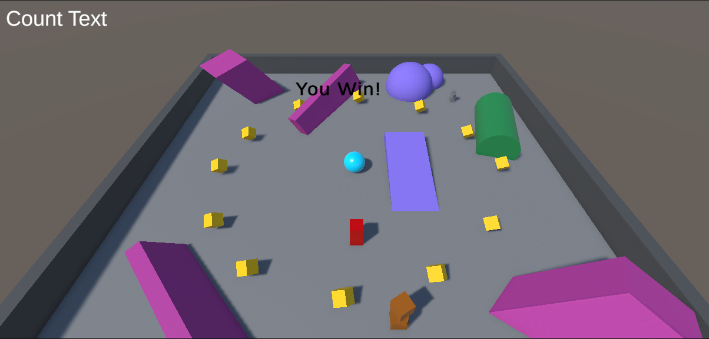

# 🌀 Escape Ball - Unity Escape Game



## 🎮 About the Game

**Escape Ball**, Unity kullanılarak geliştirilmiş basit bir kaçış oyunudur. Oyuncu, mavi renkli topu kontrol ederek arenada dağılmış olan sarı küpleri toplamaya çalışır. Oyunun temel hedefi, tüm küpleri toplamadan önce sizi kovalayan yapay zekâ ajanından kaçmaktır.

- 🟦 **Toplanabilir nesneler:** Sarı küpler
- 🟥 **Tehlike:** Kırmızı AI ajan sizi kovalıyor!
- 🧠 **Zorluk:** Rotaları kapatan engeller ve AI agent'tan kaçma
- 🎯 **Kazanma:** Tüm sarı küpleri toplarsanız **"You Win!"**
- 💀 **Kaybetme:** AI agent size temas ederse **oyunu kaybedersiniz.**

## 🧪 Project Purpose

Bu proje, Unity'nin temellerini ve Unity Editor'ünün kullanımını öğrenmek için geliştirilmiştir. Amaç:

- Unity sahne yönetimi, fizik motoru ve temel UI elementlerini öğrenmek
- 3D nesne yönetimi ve basit AI davranışı tasarlamak
- Build alma ve oynanabilir hale getirme süreçlerine alışmak

## 🔧 Technologies Used

- Unity (2020+)
- C#
- NavMesh (AI Agent için)
- Unity UI (Count Text, Win/Lose ekranları)

## 💻 How to Play

1. Oyunu başlattığınızda mavi topu ok tuşları veya `WASD` ile kontrol edin.
2. Sarı kutuları toplamaya çalışın.
3. Kırmızı AI agent’a yakalanmadan önce hepsini toplayın.
4. Hepsini toplarsanız **You Win!**, yakalanırsanız **Game Over**!

## 🕹️ Download & Play

> 🎯 [Download Windows Build (.exe)](https://drive.google.com/drive/folders/13UJ7UnduFjjY7BmDUTMR17ZpKfj1ii_E?usp=drive_link)  

Alternatif olarak, Unity Editor üzerinden projeyi çalıştırmak için:

```bash
git clone https://github.com/UmutcannDurbak/rollaball-game.git
```

Ardından Unity ile projeyi açıp SampleScene sahnesini çalıştırabilirsiniz.


📸 Screenshots


🧑‍💻 Developer

Bu oyun Umutcan Durbak tarafından, Unity öğrenme sürecinin bir parçası olarak geliştirilmiştir.

📝 Not: Bu basit oyun projesi, Unity öğrenmeye başlayan herkesin temel bilgileri pekiştirmesi için sade ve eğlenceli bir örnek sunar.